# DealPad: Architecture & Technical Decision Record

**Project:** NextGenApp Pricing & Scoping 2.0  
**Client:** Armanino LLP  
**Version:** 1.0 (Proof of Concept)  
**Date:** April 16, 2026  
**Classification:** Internal / Confidential

---

## Table of Contents

1. [Executive Summary](#1-executive-summary)
2. [Project Vision & Problem Statement](#2-project-vision--problem-statement)
3. [High-Level System Architecture](#3-high-level-system-architecture)
4. [Domain-Driven Design (DDD)](#4-domain-driven-design-ddd)
5. [Data Architecture](#5-data-architecture)
6. [AI Services Layer](#6-ai-services-layer)
7. [Role-Based Access Control (RBAC)](#7-role-based-access-control-rbac)
8. [Frontend Architecture](#8-frontend-architecture)
9. [Backend Architecture](#9-backend-architecture)
10. [API Design](#10-api-design)
11. [Deal Lifecycle & Workflow Engine](#11-deal-lifecycle--workflow-engine)
12. [Pricing Engine](#12-pricing-engine)
13. [Azure Target Architecture](#13-azure-target-architecture)
14. [External Integrations](#14-external-integrations)
15. [Observability & Monitoring](#15-observability--monitoring)
16. [Security Architecture](#16-security-architecture)
17. [Deployment Architecture](#17-deployment-architecture)
18. [Key Architectural Decisions (ADRs)](#18-key-architectural-decisions-adrs)
19. [Future Roadmap](#19-future-roadmap)

---

## 1. Executive Summary

DealPad is a full-stack Proof of Concept (PoC) application built for **Armanino LLP** to replace legacy Excel-based pricing and scoping workbooks used across the firm's consulting practice. The application introduces five AI-powered use cases, role-based access control across six organizational personas, and a modern user experience inspired by leading fintech platforms (Ramp.com, Gusto.com).

The PoC validates the core deal lifecycle workflow -- from scoping and pricing through scenario comparison and approval -- while establishing the architectural patterns and design language that will carry forward into the production Azure-hosted platform.

### Key Metrics

| Dimension | Value |
|---|---|
| Database Tables | 12 normalized tables |
| API Endpoints | 25+ REST endpoints |
| AI Use Cases | 5 simulation endpoints |
| User Personas | 6 RBAC-controlled roles |
| Deal Wizard Steps | 8-step guided workflow |
| Scope Catalog Items | 15 standardized items |
| Professional Roles | 7 billable role levels |
| Scenario Types | 3 (Standard, Premium, Value) |

---

## 2. Project Vision & Problem Statement

### Problem

Armanino's consulting practice relies on Excel workbooks for deal pricing and scoping, leading to:

- **Inconsistent pricing** across partners and service lines
- **No auditability** of pricing decisions or approval history
- **Manual effort estimation** without historical benchmarking
- **Disconnected workflows** between scoping, pricing, approval, and CRM
- **Limited visibility** for leadership into pipeline margin health

### Vision

DealPad provides a unified platform where every deal progresses through a structured, AI-augmented lifecycle:

```
Discovery -> Scoping -> Pricing -> Scenarios -> Risk Assessment -> Approval -> Delivery
```

Each stage benefits from AI insights, historical benchmarks, and role-appropriate guardrails -- replacing tribal knowledge with data-driven recommendations.

---

## 3. High-Level System Architecture

### System Architecture Diagram

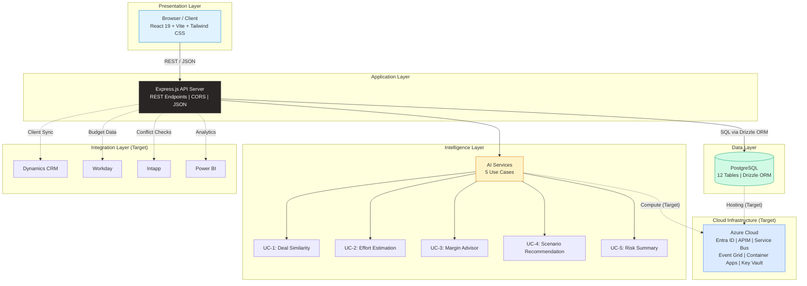
```mermaid
graph TB
    subgraph "Presentation Layer"
        Browser["Browser / Client<br/>React 19 + Vite + Tailwind CSS"]
    end

    subgraph "Application Layer"
        API["Express.js API Server<br/>REST Endpoints | CORS | JSON"]
    end

    subgraph "Intelligence Layer"
        AI["AI Services<br/>5 Use Cases"]
        AI1["UC-1: Deal Similarity"]
        AI2["UC-2: Effort Estimation"]
        AI3["UC-3: Margin Advisor"]
        AI4["UC-4: Scenario Recommendation"]
        AI5["UC-5: Risk Summary"]
        AI --> AI1 & AI2 & AI3 & AI4 & AI5
    end

    subgraph "Data Layer"
        DB[("PostgreSQL<br/>12 Tables | Drizzle ORM")]
    end

    subgraph "Integration Layer (Target)"
        CRM["Dynamics CRM"]
        WD["Workday"]
        IA["Intapp"]
        PBI["Power BI"]
    end

    subgraph "Cloud Infrastructure (Target)"
        Azure["Azure Cloud<br/>Entra ID | APIM | Service Bus<br/>Event Grid | Container Apps | Key Vault"]
    end

    Browser -->|"REST / JSON"| API
    API --> AI
    API -->|"SQL via Drizzle ORM"| DB
    API -.->|"Client Sync"| CRM
    API -.->|"Budget Data"| WD
    API -.->|"Conflict Checks"| IA
    API -.->|"Analytics"| PBI
    AI -.->|"Compute (Target)"| Azure
    DB -.->|"Hosting (Target)"| Azure

    style Browser fill:#e0f2fe,stroke:#0284c7
    style API fill:#292524,stroke:#44403c,color:#fafaf9
    style AI fill:#fef3c7,stroke:#d97706
    style DB fill:#d1fae5,stroke:#059669
    style Azure fill:#dbeafe,stroke:#3b82f6
```

### Data Flow Summary

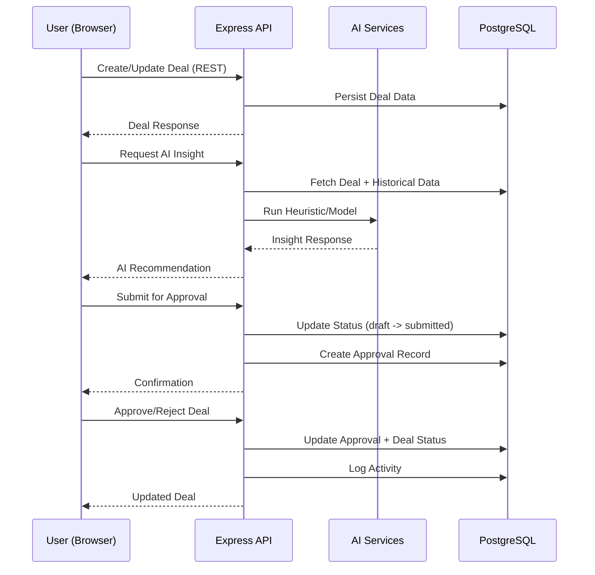
```mermaid
sequenceDiagram
    participant U as User (Browser)
    participant A as Express API
    participant AI as AI Services
    participant D as PostgreSQL

    U->>A: Create/Update Deal (REST)
    A->>D: Persist Deal Data
    A-->>U: Deal Response

    U->>A: Request AI Insight
    A->>D: Fetch Deal + Historical Data
    A->>AI: Run Heuristic/Model
    AI-->>A: Insight Response
    A-->>U: AI Recommendation

    U->>A: Submit for Approval
    A->>D: Update Status (draft -> submitted)
    A->>D: Create Approval Record
    A-->>U: Confirmation

    U->>A: Approve/Reject Deal
    A->>D: Update Approval + Deal Status
    A->>D: Log Activity
    A-->>U: Updated Deal
```

---

## 4. Domain-Driven Design (DDD)

### Bounded Contexts

The application is decomposed into six bounded contexts, each representing a distinct domain concern with its own entities, business rules, and lifecycle.

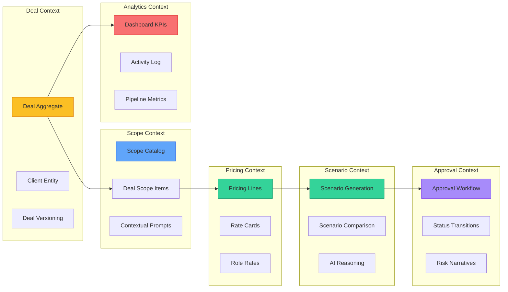
```mermaid
graph LR
    subgraph "Deal Context"
        D1["Deal Aggregate"]
        D2["Client Entity"]
        D3["Deal Versioning"]
    end

    subgraph "Scope Context"
        S1["Scope Catalog"]
        S2["Deal Scope Items"]
        S3["Contextual Prompts"]
    end

    subgraph "Pricing Context"
        P1["Pricing Lines"]
        P2["Rate Cards"]
        P3["Role Rates"]
    end

    subgraph "Scenario Context"
        SC1["Scenario Generation"]
        SC2["Scenario Comparison"]
        SC3["AI Reasoning"]
    end

    subgraph "Approval Context"
        A1["Approval Workflow"]
        A2["Status Transitions"]
        A3["Risk Narratives"]
    end

    subgraph "Analytics Context"
        AN1["Dashboard KPIs"]
        AN2["Activity Log"]
        AN3["Pipeline Metrics"]
    end

    D1 --> S2
    S2 --> P1
    P1 --> SC1
    SC1 --> A1
    D1 --> AN1

    style D1 fill:#fbbf24,stroke:#d97706
    style S1 fill:#60a5fa,stroke:#2563eb
    style P1 fill:#34d399,stroke:#059669
    style SC1 fill:#34d399,stroke:#059669
    style A1 fill:#a78bfa,stroke:#7c3aed
    style AN1 fill:#f87171,stroke:#dc2626
```

### Context Details

| Context | User Stories | Core Entities | Key Business Rules |
|---|---|---|---|
| **Deal Context** | US-01 to US-07 | Deal, Client, Deal Number | Unique deal numbering; client relationship tracking; deal cloning/renewal; parent-child deal linking |
| **Scope Context** | US-08 to US-17 | Scope Catalog, Deal Scope Items, Prompt Responses | Hierarchical scope catalog with assemblies; contextual prompts with impact multipliers; scope-to-pricing recalculation |
| **Pricing Context** | US-18 to US-31 | Pricing Lines, Rate Cards, Rate Card Entries, Roles | 7-tier role hierarchy; complexity multipliers (0.8x-1.5x); automatic margin/fee/cost calculation; rate card versioning |
| **Approval Context** | US-39 to US-45 | Approvals | Status state machine (draft->submitted->approved/rejected); approver comments; AI narrative attachment |
| **Catalog & Config** | US-54 to US-57 | Rate Cards, Scope Catalog | Admin governance; rate card effective dates; regional rate support |
| **Analytics Context** | US-32 to US-38 | Activity Log, Dashboard Summary | Role-aware KPIs; pending approval counts; pipeline status breakdown; recent activity feed |

### Aggregate Design

The **Deal** is the primary aggregate root, with the following composition:

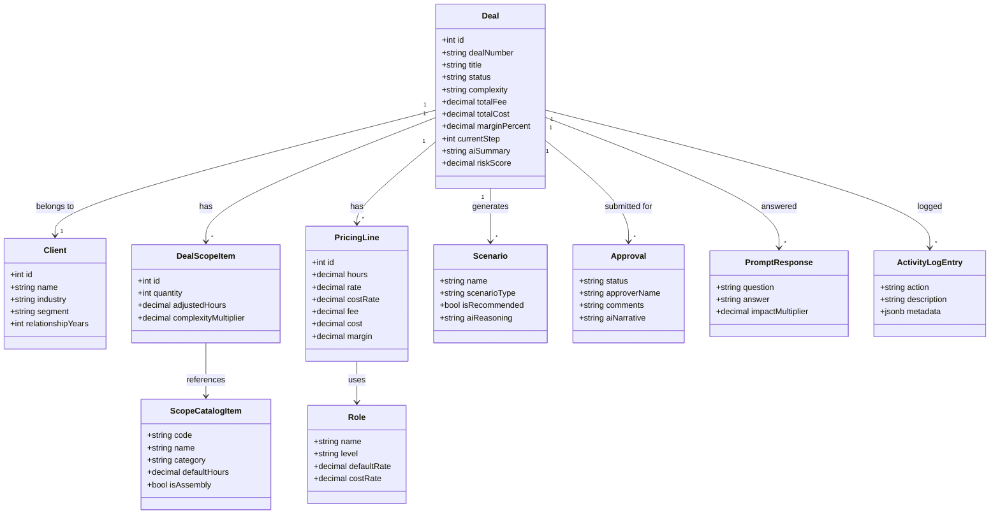
```mermaid
classDiagram
    class Deal {
        +int id
        +string dealNumber
        +string title
        +string status
        +string complexity
        +decimal totalFee
        +decimal totalCost
        +decimal marginPercent
        +int currentStep
        +string aiSummary
        +decimal riskScore
    }

    class Client {
        +int id
        +string name
        +string industry
        +string segment
        +int relationshipYears
    }

    class DealScopeItem {
        +int id
        +int quantity
        +decimal adjustedHours
        +decimal complexityMultiplier
    }

    class ScopeCatalogItem {
        +string code
        +string name
        +string category
        +decimal defaultHours
        +bool isAssembly
    }

    class PricingLine {
        +int id
        +decimal hours
        +decimal rate
        +decimal costRate
        +decimal fee
        +decimal cost
        +decimal margin
    }

    class Role {
        +string name
        +string level
        +decimal defaultRate
        +decimal costRate
    }

    class Scenario {
        +string name
        +string scenarioType
        +bool isRecommended
        +string aiReasoning
    }

    class Approval {
        +string status
        +string approverName
        +string comments
        +string aiNarrative
    }

    class PromptResponse {
        +string question
        +string answer
        +decimal impactMultiplier
    }

    class ActivityLogEntry {
        +string action
        +string description
        +jsonb metadata
    }

    Deal "1" --> "1" Client : belongs to
    Deal "1" --> "*" DealScopeItem : has
    DealScopeItem --> ScopeCatalogItem : references
    Deal "1" --> "*" PricingLine : has
    PricingLine --> Role : uses
    Deal "1" --> "*" Scenario : generates
    Deal "1" --> "*" Approval : submitted for
    Deal "1" --> "*" PromptResponse : answered
    Deal "1" --> "*" ActivityLogEntry : logged
```

### Context Mapping (Anti-Corruption Patterns)

| Upstream Context | Downstream Context | Relationship |
|---|---|---|
| Scope Context | Pricing Context | Conformist -- scope hours drive pricing line generation via `recalcPricingFromScope()` |
| Pricing Context | Scenario Context | Published Language -- scenarios are auto-generated from base pricing with multiplier adjustments (0.9x, 1.0x, 1.15x) |
| Deal Context | Approval Context | Customer/Supplier -- deal status transitions are governed by approval outcomes |
| Deal Context | Analytics Context | Published Language -- dashboard aggregates deal data through summary queries |
| Catalog & Config | Scope Context | Shared Kernel -- scope catalog items are referenced by deal scope items |
| Catalog & Config | Pricing Context | Shared Kernel -- rate cards and roles provide pricing baselines |

---

## 5. Data Architecture

### Entity-Relationship Diagram

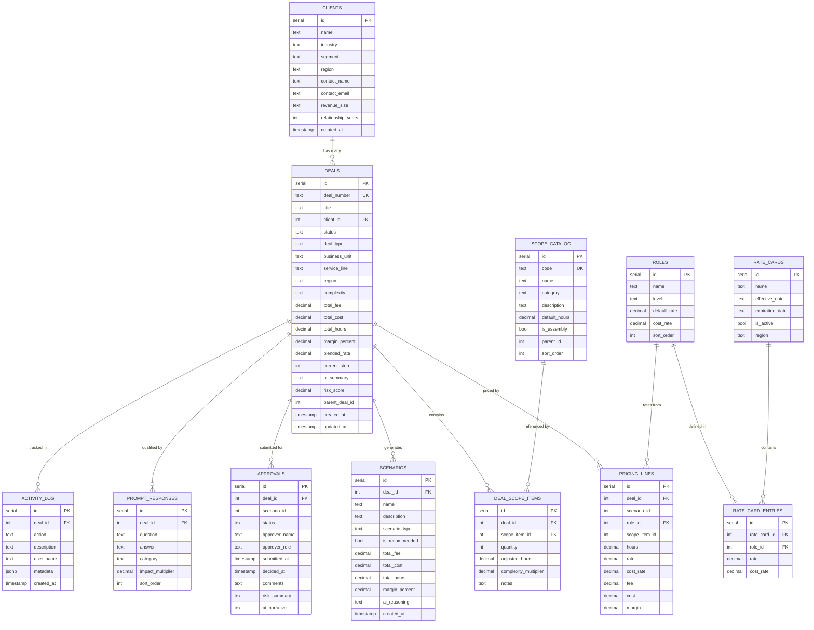
```mermaid
erDiagram
    CLIENTS ||--o{ DEALS : "has many"
    DEALS ||--o{ DEAL_SCOPE_ITEMS : "contains"
    DEALS ||--o{ PRICING_LINES : "priced by"
    DEALS ||--o{ SCENARIOS : "generates"
    DEALS ||--o{ APPROVALS : "submitted for"
    DEALS ||--o{ PROMPT_RESPONSES : "qualified by"
    DEALS ||--o{ ACTIVITY_LOG : "tracked in"
    SCOPE_CATALOG ||--o{ DEAL_SCOPE_ITEMS : "referenced by"
    ROLES ||--o{ PRICING_LINES : "rates from"
    ROLES ||--o{ RATE_CARD_ENTRIES : "defined in"
    RATE_CARDS ||--o{ RATE_CARD_ENTRIES : "contains"

    CLIENTS {
        serial id PK
        text name
        text industry
        text segment
        text region
        text contact_name
        text contact_email
        text revenue_size
        int relationship_years
        timestamp created_at
    }

    DEALS {
        serial id PK
        text deal_number UK
        text title
        int client_id FK
        text status
        text deal_type
        text business_unit
        text service_line
        text region
        text complexity
        decimal total_fee
        decimal total_cost
        decimal total_hours
        decimal margin_percent
        decimal blended_rate
        int current_step
        text ai_summary
        decimal risk_score
        int parent_deal_id
        timestamp created_at
        timestamp updated_at
    }

    SCOPE_CATALOG {
        serial id PK
        text code UK
        text name
        text category
        text description
        decimal default_hours
        bool is_assembly
        int parent_id
        int sort_order
    }

    DEAL_SCOPE_ITEMS {
        serial id PK
        int deal_id FK
        int scope_item_id FK
        int quantity
        decimal adjusted_hours
        decimal complexity_multiplier
        text notes
    }

    ROLES {
        serial id PK
        text name
        text level
        decimal default_rate
        decimal cost_rate
        int sort_order
    }

    RATE_CARDS {
        serial id PK
        text name
        text effective_date
        text expiration_date
        bool is_active
        text region
    }

    RATE_CARD_ENTRIES {
        serial id PK
        int rate_card_id FK
        int role_id FK
        decimal rate
        decimal cost_rate
    }

    PRICING_LINES {
        serial id PK
        int deal_id FK
        int scenario_id
        int role_id FK
        int scope_item_id
        decimal hours
        decimal rate
        decimal cost_rate
        decimal fee
        decimal cost
        decimal margin
    }

    SCENARIOS {
        serial id PK
        int deal_id FK
        text name
        text description
        text scenario_type
        bool is_recommended
        decimal total_fee
        decimal total_cost
        decimal total_hours
        decimal margin_percent
        text ai_reasoning
        timestamp created_at
    }

    APPROVALS {
        serial id PK
        int deal_id FK
        int scenario_id
        text status
        text approver_name
        text approver_role
        timestamp submitted_at
        timestamp decided_at
        text comments
        text risk_summary
        text ai_narrative
    }

    PROMPT_RESPONSES {
        serial id PK
        int deal_id FK
        text question
        text answer
        text category
        decimal impact_multiplier
        int sort_order
    }

    ACTIVITY_LOG {
        serial id PK
        int deal_id FK
        text action
        text description
        text user_name
        jsonb metadata
        timestamp created_at
    }
```

### Schema Design Decisions

| Decision | Rationale |
|---|---|
| **Drizzle ORM with `shared/schema.ts`** | Single source of truth for data model, shared between frontend (type inference) and backend (query building). Eliminates schema drift. |
| **Serial integer primary keys** | Simpler than UUIDs for the PoC; production migration to UUIDs is straightforward |
| **Decimal types for financial fields** | `DECIMAL(12,2)` for monetary values avoids floating-point precision errors critical in pricing calculations |
| **Text-based dates for `start_date`/`end_date`** | ISO string dates simplify frontend handling; timestamps used only for audit fields (`created_at`, `updated_at`) |
| **JSONB for `activity_log.metadata`** | Flexible schema for varying activity metadata without table proliferation |
| **Hierarchical scope catalog** | `parent_id` supports assembly/sub-item nesting for complex scope structures |
| **AI metadata fields on domain entities** | `deals.ai_summary`, `scenarios.ai_reasoning`, `approvals.ai_narrative` store AI outputs alongside business data |

### Seed Data Strategy

The database is automatically seeded on first startup with realistic demonstration data:

- **3 Clients**: Acme Corporation, GlobalTech Industries, Meridian Financial (varying industries, segments, relationship depths)
- **7 Professional Roles**: Partner through Analyst with market-rate billing and cost rates
- **1 Active Rate Card**: FY2026 Standard (National, effective 2025-07-01)
- **14 Scope Catalog Items**: Across Architecture, Implementation, Testing, Project Management, and Training categories
- **3 Demonstration Deals**: Different statuses (draft, submitted, approved), service lines, and complexity levels
- **Pre-built pricing lines, scenarios, and approvals** for the approved deal

---

## 6. AI Services Layer

### Overview

The AI Services Layer implements five use cases that augment human decision-making across the deal lifecycle. In the PoC, these are implemented as **deterministic heuristic engines** that simulate AI behavior using rule-based logic and database queries. The target production architecture replaces these with Azure OpenAI LLM calls orchestrated through Semantic Kernel.

### AI Use Case Architecture

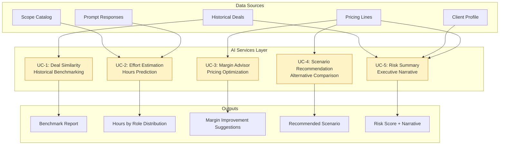
```mermaid
graph TD
    subgraph "AI Services Layer"
        UC1["UC-1: Deal Similarity<br/>Historical Benchmarking"]
        UC2["UC-2: Effort Estimation<br/>Hours Prediction"]
        UC3["UC-3: Margin Advisor<br/>Pricing Optimization"]
        UC4["UC-4: Scenario Recommendation<br/>Alternative Comparison"]
        UC5["UC-5: Risk Summary<br/>Executive Narrative"]
    end

    subgraph "Data Sources"
        HD["Historical Deals"]
        SC["Scope Catalog"]
        PL["Pricing Lines"]
        PR["Prompt Responses"]
        CL["Client Profile"]
    end

    subgraph "Outputs"
        O1["Benchmark Report"]
        O2["Hours by Role Distribution"]
        O3["Margin Improvement Suggestions"]
        O4["Recommended Scenario"]
        O5["Risk Score + Narrative"]
    end

    HD --> UC1 --> O1
    SC & PR --> UC2 --> O2
    PL --> UC3 --> O3
    PL --> UC4 --> O4
    HD & CL & PL --> UC5 --> O5

    style UC1 fill:#fef3c7,stroke:#d97706
    style UC2 fill:#fef3c7,stroke:#d97706
    style UC3 fill:#fef3c7,stroke:#d97706
    style UC4 fill:#fef3c7,stroke:#d97706
    style UC5 fill:#fef3c7,stroke:#d97706
```

### Use Case Details

#### UC-1: Deal Similarity (`POST /api/ai/deal-similarity`)

**Purpose:** Benchmarks a new engagement against historical approved deals from the same client or service line.

**PoC Logic:**
- Queries the database for approved deals matching the same `clientId`
- Falls back to all approved deals if no client-specific matches exist
- Computes average margin, average fee, and deal count
- Returns similar deal details plus a natural-language benchmark recommendation

**Input:** `{ clientId, serviceLine, businessUnit }`  
**Output:** `{ similarDeals[], insights: { averageMargin, averageFee, recommendation } }`

**Target Implementation:** RAG (Retrieval-Augmented Generation) over a vector store of historical deal embeddings, with Azure OpenAI generating contextual recommendations.

#### UC-2: Effort Estimation (`POST /api/ai/effort-estimation`)

**Purpose:** Predicts total hours and role distribution based on scope complexity and contextual prompts.

**PoC Logic:**
- Applies complexity multipliers: `low=0.8x, medium=1.0x, high=1.2x, very_high=1.5x`
- Compounds with prompt response impact multipliers (e.g., multi-region = 1.2x)
- Distributes total hours across 7 roles using a fixed distribution model:
  - Partner: 7%, MD: 10%, Sr. Manager: 17%, Manager: 20%, Sr. Consultant: 26%, Consultant: 13%, Analyst: 7%

**Input:** `{ scopeItems[], complexity, prompts[] }`  
**Output:** `{ estimatedItems[], totalHours, roleDistribution[], narrative }`

**Target Implementation:** Fine-tuned model trained on Armanino's historical engagement data for role distribution prediction.

#### UC-3: Margin Advisor (`POST /api/ai/margin-advisor`)

**Purpose:** Analyzes current pricing structure and suggests optimizations to meet margin targets.

**PoC Logic:**
- Calculates current margin from pricing line fee/cost totals
- If below target (default 25%), suggests:
  1. **Role Shift:** Move 40 hours from senior to junior roles (quantified margin impact)
  2. **Rate Uplift:** Apply 5% rate increase across all roles (~3.5% margin improvement)
- If on target, returns confirmation with no-change recommendation

**Input:** `{ pricingLines[], targetMargin }`  
**Output:** `{ currentMargin, targetMargin, isOnTarget, suggestions[] }`

**Target Implementation:** Optimization model using linear programming to find optimal role mix given constraints (minimum partner hours, skill requirements, margin targets).

#### UC-4: Scenario Recommendation (`POST /api/ai/scenario-recommendation`)

**Purpose:** Compares generated pricing scenarios and recommends the best option.

**PoC Logic:**
- Retrieves all scenarios for a deal
- Identifies the `isRecommended` scenario (typically "Premium" with best margin profile)
- Returns comparative analysis with confidence score (0.87 for PoC)

**Scenario Generation Algorithm (triggered on first access):**
- **Standard (1.0x):** Base pricing as-is
- **Premium (1.15x):** 15% rate uplift, improved margins, ~10% fewer hours
- **Value (0.9x):** 10% rate discount, volume-play positioning

**Input:** `{ dealId }`  
**Output:** `{ recommendation: { scenarioName, reasoning, confidence }, scenarios[], narrative }`

**Target Implementation:** Multi-criteria decision analysis with LLM-generated reasoning customized to client relationship context.

#### UC-5: Risk Summary (`POST /api/ai/risk-summary`)

**Purpose:** Generates an executive-level risk assessment with approval likelihood prediction.

**PoC Logic:**
- Evaluates risk factors:
  - Margin below 25% target (medium) or below 20% (high severity)
  - High/very-high complexity (medium severity)
  - Large engagements over 1,000 hours (low severity, governance flag)
  - Strong client relationship > 3 years (positive factor)
- Generates a natural-language executive narrative incorporating all factors
- Predicts approval likelihood: Low risk = 89%, Medium = 72%, High = 45%

**Input:** `{ dealId }`  
**Output:** `{ riskLevel, riskScore, riskFactors[], executiveSummary, narrative, approvalLikelihood }`

**Target Implementation:** Azure OpenAI with structured output schema, incorporating firm-wide policy rules and historical approval patterns.

### Contextual Prompts System

The Contextual Prompts system feeds qualitative deal information into the quantitative pricing engine:

| Prompt | Category | Purpose |
|---|---|---|
| How many geographic regions are involved? | Complexity | Multi-region multiplier |
| Are there regulatory/compliance requirements? | Compliance | Compliance effort uplift |
| What is the expected data volume? | Complexity | Scale factor |
| How many integrations are required? | Integration | Integration complexity |
| Is there an existing system being replaced? | Migration | Migration effort |
| What is the client's technical maturity? | Client | Delivery risk adjustment |
| Is there a hard deadline or external dependency? | Timeline | Timeline pressure factor |

Each prompt response carries an `impactMultiplier` (default 1.0) that compounds into the total effort calculation, creating a data-driven bridge between qualitative assessment and quantitative pricing.

---

## 7. Role-Based Access Control (RBAC)

### RBAC Architecture

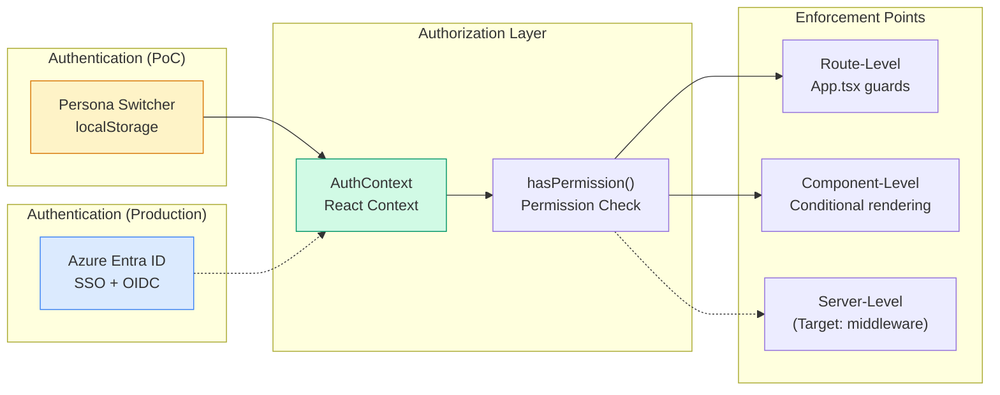
```mermaid
graph LR
    subgraph "Authentication (PoC)"
        PS["Persona Switcher<br/>localStorage"]
    end

    subgraph "Authentication (Production)"
        EID["Azure Entra ID<br/>SSO + OIDC"]
    end

    subgraph "Authorization Layer"
        AC["AuthContext<br/>React Context"]
        HP["hasPermission()<br/>Permission Check"]
    end

    subgraph "Enforcement Points"
        RL["Route-Level<br/>App.tsx guards"]
        CL["Component-Level<br/>Conditional rendering"]
        SL["Server-Level<br/>(Target: middleware)"]
    end

    PS --> AC
    EID -.-> AC
    AC --> HP
    HP --> RL & CL
    HP -.-> SL

    style PS fill:#fef3c7,stroke:#d97706
    style EID fill:#dbeafe,stroke:#3b82f6
    style AC fill:#d1fae5,stroke:#059669
```

### Persona Matrix

| Role ID | Name | Title | Accent Color | Primary Domain |
|---|---|---|---|---|
| `pdl` | Michael Torres | Project Delivery Lead | Orange (#DA720F) | Deal creation, scoping, pricing, AI tools |
| `sll` | Sarah Chen | Service Line Leader | Blue (#3b82f6) | Deal approval, pipeline oversight |
| `po` | James Wright | Pricing Operations | Emerald (#059669) | Rate card & scope catalog governance |
| `fin` | Lisa Park | Finance / FP&A | Violet (#7c3aed) | Margin validation, financial metrics |
| `qrm` | David Kim | Risk / QRM | Red (#dc2626) | Risk compliance, AI risk summaries |
| `it` | Alex Rivera | IT / Data Consumer | Stone (#78716c) | Architecture, infrastructure |

### Permission Matrix

| Permission | PDL | SLL | PO | FIN | QRM | IT |
|---|---|---|---|---|---|---|
| `createDeals` | Yes | - | - | - | - | - |
| `editDeals` | Yes | - | - | - | - | - |
| `viewDeals` | Yes | Yes | Yes | Yes | Yes | - |
| `approveDeals` | - | Yes | - | - | - | - |
| `manageRateCards` | - | - | Yes | - | - | - |
| `manageScopeCatalog` | - | - | Yes | - | - | - |
| `viewPricing` | Yes | Yes | Yes | Yes | Yes | - |
| `editPricing` | Yes | - | - | - | - | - |
| `viewMargins` | Yes | Yes | Yes | Yes | Yes | - |
| `viewRiskSummary` | Yes | Yes | - | - | Yes | - |
| `viewArchitecture` | Yes | Yes | Yes | Yes | Yes | Yes |
| `viewDashboard` | Yes | Yes | Yes | Yes | Yes | Yes |
| `runAI` | Yes | - | - | - | - | - |

### Enforcement Strategy

**PoC (Client-Side):**
- Persona selection stored in `localStorage` (key: `dealpad_persona`)
- `AuthContext` provides `hasPermission(key)` memoized callback
- Route guards in `App.tsx` render `NoAccess` component for unauthorized routes
- UI elements (buttons, sidebar links, action cards) conditionally rendered based on permissions
- Dashboard adapts greeting, accent color, KPIs, and quick actions per persona

**Production Target (Server-Side):**
- Azure Entra ID provides SSO with OIDC tokens
- JWT middleware validates tokens and extracts role claims
- Server-side permission enforcement on all API endpoints
- Row-level security for multi-tenant data isolation

---

## 8. Frontend Architecture

### Technology Stack

| Layer | Technology | Version | Purpose |
|---|---|---|---|
| Framework | React | 19 | Component-based UI |
| Build Tool | Vite | 8.x | Fast HMR, optimized builds |
| Language | TypeScript | - | Type safety |
| Styling | Tailwind CSS | 4.x | Utility-first CSS |
| Routing | Wouter | 3.9 | Lightweight client-side routing |
| Server State | TanStack React Query | 5.x | Data fetching, caching, mutation |
| UI Primitives | Radix UI | Various | Accessible, unstyled components |
| Icons | Lucide React | 1.8 | Consistent icon system |
| Animation | Framer Motion | 12.x | Smooth UI transitions |
| Charts | Recharts | 3.8 | Data visualization |
| Date Handling | date-fns | 4.x | Date formatting and manipulation |

### Component Architecture

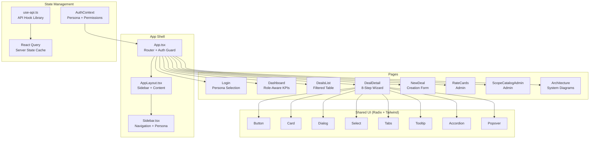
```mermaid
graph TD
    subgraph "App Shell"
        App["App.tsx<br/>Router + Auth Guard"]
        AL["AppLayout.tsx<br/>Sidebar + Content"]
        SB["Sidebar.tsx<br/>Navigation + Persona"]
    end

    subgraph "Pages"
        Login["Login<br/>Persona Selection"]
        Dash["Dashboard<br/>Role-Aware KPIs"]
        DL["DealsList<br/>Filtered Table"]
        DD["DealDetail<br/>8-Step Wizard"]
        ND["NewDeal<br/>Creation Form"]
        RC["RateCards<br/>Admin"]
        SCA["ScopeCatalogAdmin<br/>Admin"]
        Arch["Architecture<br/>System Diagrams"]
    end

    subgraph "Shared UI (Radix + Tailwind)"
        BTN["Button"]
        CRD["Card"]
        DLG["Dialog"]
        SEL["Select"]
        TBS["Tabs"]
        TTP["Tooltip"]
        ACC["Accordion"]
        POP["Popover"]
    end

    subgraph "State Management"
        ACtx["AuthContext<br/>Persona + Permissions"]
        RQ["React Query<br/>Server State Cache"]
        Hooks["use-api.ts<br/>API Hook Library"]
    end

    App --> AL --> SB
    App --> Login & Dash & DL & DD & ND & RC & SCA & Arch
    DD --> BTN & CRD & DLG & SEL & TBS & TTP & ACC & POP
    Hooks --> RQ
    ACtx --> App
```

### Design System

**Brand Identity:**
- Primary color: Armanino amber `#DA720F`
- Background: Warm stone `#fafaf9`
- Sidebar: Dark stone `#1c1917`
- Typography: Inter (system font stack)
- No emojis in the UI

**Design Language:**
- Inspired by Ramp.com and Gusto.com
- Clean, data-dense layouts with generous whitespace
- Card-based information architecture
- Consistent icon usage (Lucide)
- Persona-specific accent colors on dashboard elements

**Tailwind CSS v4 Configuration:**
- CSS custom properties for theming (`--color-primary`, `--color-background`, etc.)
- `@layer components` for reusable component styles (`.btn`, `.card`, `.badge`)
- Responsive design with mobile-first breakpoints

### Page Architecture

| Page | Route | Key Features |
|---|---|---|
| Login | `/login` | 6-persona card grid, animated transitions, role descriptions |
| Dashboard | `/` | Role-aware KPIs (3-4 cards), quick actions, recent activity, pipeline status breakdown |
| Deals List | `/deals` | Status filter (from URL params), sortable table, deal number links |
| New Deal | `/deals/new` | Client selection, deal type, service line, complexity picker |
| Deal Detail | `/deals/:id` | 8-step wizard: Setup, Scope, Assumptions, Pricing, Scenarios, Review, Approval, Summary |
| Rate Cards | `/admin/rate-cards` | Rate card CRUD, role-rate editing, effective date management |
| Scope Catalog | `/admin/scope-catalog` | Catalog item management, category filtering, assembly designation |
| Architecture | `/architecture` | Interactive system diagram, DDD context map, technology stack |

### Deal Wizard (8 Steps)


```mermaid
graph LR
    S1["1. Setup<br/>Deal Info & Client"] --> S2["2. Scope<br/>Item Selection"]
    S2 --> S3["3. Assumptions<br/>Contextual Prompts"]
    S3 --> S4["4. Pricing<br/>Role Grid"]
    S4 --> S5["5. Scenarios<br/>Compare Options"]
    S5 --> S6["6. Review<br/>AI Risk Assessment"]
    S6 --> S7["7. Approval<br/>Submit / Review"]
    S7 --> S8["8. Summary<br/>Final View"]

    style S1 fill:#fef3c7,stroke:#d97706
    style S2 fill:#dbeafe,stroke:#3b82f6
    style S3 fill:#fef3c7,stroke:#d97706
    style S4 fill:#d1fae5,stroke:#059669
    style S5 fill:#d1fae5,stroke:#059669
    style S6 fill:#fecaca,stroke:#dc2626
    style S7 fill:#e9d5ff,stroke:#7c3aed
    style S8 fill:#f5f5f4,stroke:#78716c
```

---

## 9. Backend Architecture

### Technology Stack

| Layer | Technology | Purpose |
|---|---|---|
| Runtime | Node.js + tsx | TypeScript execution without compilation |
| Framework | Express.js 5.x | HTTP server and routing |
| ORM | Drizzle ORM 0.45 | Type-safe SQL queries with relational API |
| Database Driver | pg (node-postgres) | PostgreSQL connection pooling |
| Validation | Zod 4.x (available) | Runtime schema validation (installed, not yet integrated into route handlers) |
| CORS | cors middleware | Cross-origin request handling |

### Server Architecture

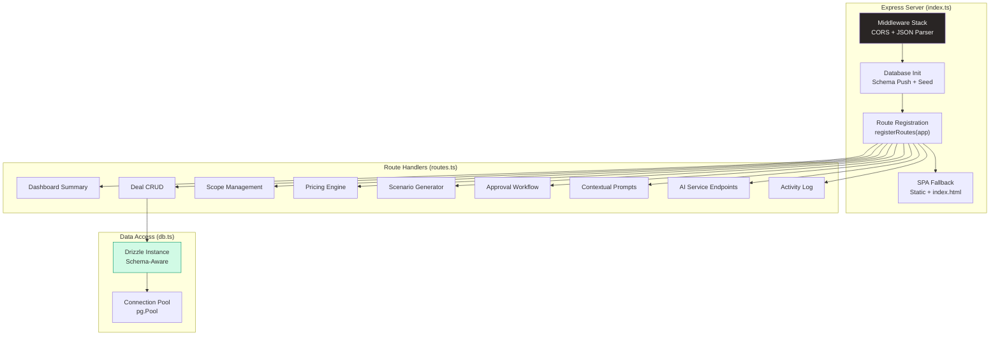
```mermaid
graph TD
    subgraph "Express Server (index.ts)"
        MW["Middleware Stack<br/>CORS + JSON Parser"]
        INIT["Database Init<br/>Schema Push + Seed"]
        REG["Route Registration<br/>registerRoutes(app)"]
        SPA["SPA Fallback<br/>Static + index.html"]
    end

    subgraph "Route Handlers (routes.ts)"
        DASH["Dashboard Summary"]
        DEAL["Deal CRUD"]
        SCOPE["Scope Management"]
        PRICE["Pricing Engine"]
        SCEN["Scenario Generator"]
        APPR["Approval Workflow"]
        PROMPT["Contextual Prompts"]
        AIS["AI Service Endpoints"]
        ACT["Activity Log"]
    end

    subgraph "Data Access (db.ts)"
        POOL["Connection Pool<br/>pg.Pool"]
        DRZ["Drizzle Instance<br/>Schema-Aware"]
    end

    MW --> INIT --> REG --> SPA
    REG --> DASH & DEAL & SCOPE & PRICE & SCEN & APPR & PROMPT & AIS & ACT
    DEAL --> DRZ --> POOL

    style MW fill:#292524,color:#fafaf9
    style DRZ fill:#d1fae5,stroke:#059669
```

### Startup Sequence

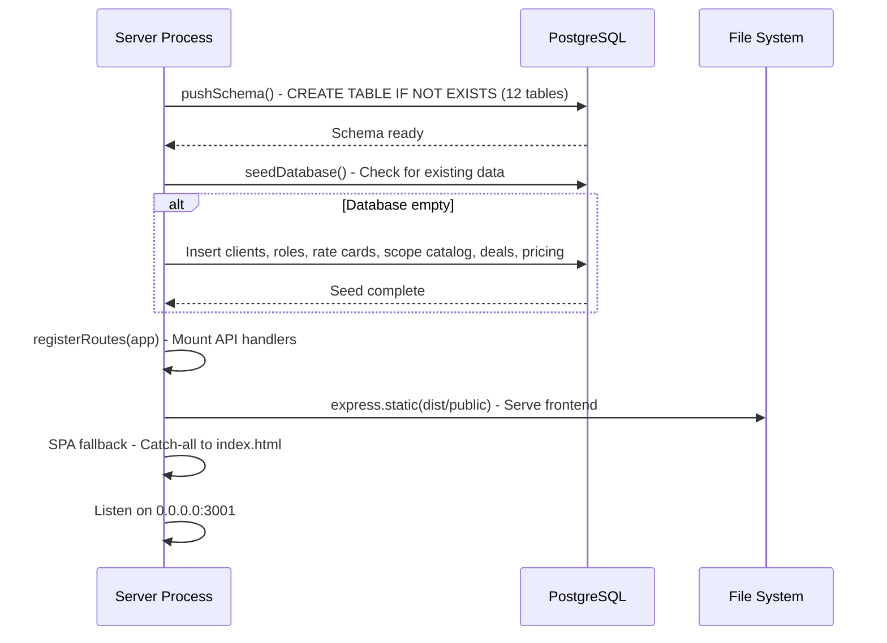
```mermaid
sequenceDiagram
    participant S as Server Process
    participant DB as PostgreSQL
    participant FS as File System

    S->>DB: pushSchema() - CREATE TABLE IF NOT EXISTS (12 tables)
    DB-->>S: Schema ready
    S->>DB: seedDatabase() - Check for existing data
    alt Database empty
        S->>DB: Insert clients, roles, rate cards, scope catalog, deals, pricing
        DB-->>S: Seed complete
    end
    S->>S: registerRoutes(app) - Mount API handlers
    S->>FS: express.static(dist/public) - Serve frontend
    S->>S: SPA fallback - Catch-all to index.html
    S->>S: Listen on 0.0.0.0:3001
```

### Key Backend Patterns

| Pattern | Implementation | Purpose |
|---|---|---|
| **Automatic Recalculation** | `recalcPricingFromScope()` | Any scope change triggers full pricing recalc with role distribution |
| **Cascading Updates** | Deal PATCH triggers recalc + activity log | Ensures data consistency across related entities |
| **Scenario Auto-Generation** | GET scenarios creates if none exist | Lazy generation of Standard/Premium/Value scenarios |
| **Default Prompts** | `createDefaultPrompts()` on deal creation | 7 standard discovery questions auto-attached |
| **Activity Logging** | Action recorded on deal create/update/approval | Full audit trail with actor attribution |

---

## 10. API Design

### Endpoint Catalog


```mermaid
graph LR
    subgraph "RESTful API (/api)"
        subgraph "Dashboard"
            G1["GET /dashboard/summary"]
        end

        subgraph "Clients"
            G2["GET /clients"]
            G3["GET /clients/:id"]
        end

        subgraph "Deals"
            G4["GET /deals"]
            G5["GET /deals/:id"]
            P1["POST /deals"]
            PA1["PATCH /deals/:id"]
            P2["POST /deals/:id/clone"]
        end

        subgraph "Scope"
            G6["GET /scope-catalog"]
            G7["GET /deals/:dealId/scope-items"]
            P3["POST /deals/:dealId/scope-items"]
            D1["DELETE /deals/:dealId/scope-items/:id"]
        end

        subgraph "Roles & Rates"
            G12["GET /roles"]
            G13["GET /rate-cards"]
            G14["GET /rate-cards/:id/entries"]
        end

        subgraph "Pricing"
            G8["GET /deals/:dealId/pricing"]
            P4["POST /deals/:dealId/pricing"]
            PA2["PATCH /deals/:dealId/pricing/:id"]
            D2["DELETE /deals/:dealId/pricing"]
        end

        subgraph "Scenarios"
            G9["GET /deals/:dealId/scenarios"]
            P5["POST /deals/:dealId/scenarios/:id/select"]
        end

        subgraph "Approvals"
            G10["GET /deals/:dealId/approvals"]
            P6["POST /deals/:dealId/approvals"]
            PA3["PATCH /approvals/:id"]
        end

        subgraph "Prompts"
            G15["GET /deals/:dealId/prompts"]
            P7["POST /deals/:dealId/prompts"]
            PA4["PATCH /deals/:dealId/prompts/:id"]
        end

        subgraph "AI Services"
            AI1["POST /ai/deal-similarity"]
            AI2["POST /ai/effort-estimation"]
            AI3["POST /ai/margin-advisor"]
            AI4["POST /ai/scenario-recommendation"]
            AI5["POST /ai/risk-summary"]
        end

        subgraph "Activity"
            G11["GET /activity"]
        end
    end
```

### API Response Patterns

All API responses follow consistent patterns:

- **List endpoints:** Return JSON arrays
- **Detail endpoints:** Return JSON objects with nested relations (via Drizzle's `with` clause)
- **Mutation endpoints:** Return the created/updated entity
- **AI endpoints:** Return structured responses with `narrative` text fields for UI display
- **Error responses:** Standard HTTP status codes with `{ error: "message" }` body

### Deal Detail Response (Nested Relations)

The `GET /deals/:id` endpoint returns a fully hydrated deal object:

```json
{
  "id": 1,
  "dealNumber": "DL-2026-001",
  "title": "ERP Modernization",
  "status": "approved",
  "client": { "id": 1, "name": "Acme Corporation", "industry": "Technology" },
  "scopeItems": [
    {
      "id": 1,
      "quantity": 1,
      "adjustedHours": "120.00",
      "scopeItem": { "code": "ARCH-001", "name": "System Architecture Design" }
    }
  ],
  "pricingLines": [
    {
      "id": 1,
      "hours": "30.00",
      "rate": "550.00",
      "fee": "16500.00",
      "role": { "name": "Partner", "level": "Partner" }
    }
  ],
  "scenarios": [],
  "approvals": [],
  "promptResponses": [],
  "activities": []
}
```

---

## 11. Deal Lifecycle & Workflow Engine

### State Machine

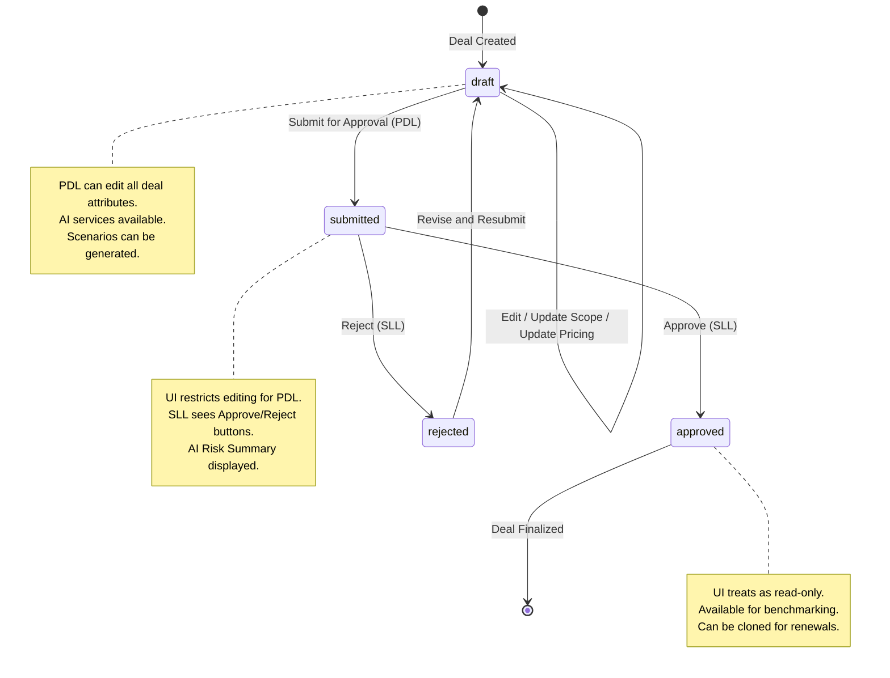
```mermaid
stateDiagram-v2
    [*] --> draft: Deal Created

    draft --> draft: Edit / Update Scope / Update Pricing
    draft --> submitted: Submit for Approval (PDL)

    submitted --> approved: Approve (SLL)
    submitted --> rejected: Reject (SLL)

    rejected --> draft: Revise and Resubmit
    approved --> [*]: Deal Finalized

    note right of draft
        PDL can edit all deal attributes.
        AI services available.
        Scenarios can be generated.
    end note

    note right of submitted
        UI restricts editing for PDL.
        SLL sees Approve/Reject buttons.
        AI Risk Summary displayed.
    end note

    note right of approved
        UI treats as read-only.
        Available for benchmarking.
        Can be cloned for renewals.
    end note
```

**Implementation Note (PoC):** The state machine transitions shown above are enforced at the **UI layer** (conditional button rendering based on deal status and persona permissions). The server-side API does not currently enforce status transition rules -- `PATCH /api/deals/:id` accepts updates regardless of current status. Production will add server-side middleware to enforce the state machine, reject invalid transitions, and validate actor authorization.

### Deal Creation Flow

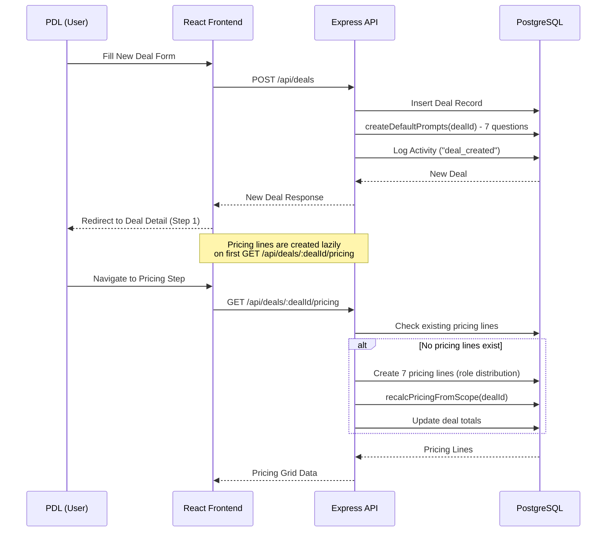
```mermaid
sequenceDiagram
    participant PDL as PDL (User)
    participant UI as React Frontend
    participant API as Express API
    participant DB as PostgreSQL

    PDL->>UI: Fill New Deal Form
    UI->>API: POST /api/deals
    API->>DB: Insert Deal Record
    API->>DB: createDefaultPrompts(dealId) - 7 questions
    API->>DB: Log Activity ("deal_created")
    DB-->>API: New Deal
    API-->>UI: New Deal Response
    UI-->>PDL: Redirect to Deal Detail (Step 1)

    Note over UI,API: Pricing lines are created lazily<br/>on first GET /api/deals/:dealId/pricing
    PDL->>UI: Navigate to Pricing Step
    UI->>API: GET /api/deals/:dealId/pricing
    API->>DB: Check existing pricing lines
    alt No pricing lines exist
        API->>DB: Create 7 pricing lines (role distribution)
        API->>DB: recalcPricingFromScope(dealId)
        API->>DB: Update deal totals
    end
    DB-->>API: Pricing Lines
    API-->>UI: Pricing Grid Data
```

### Clone / Renewal Flow

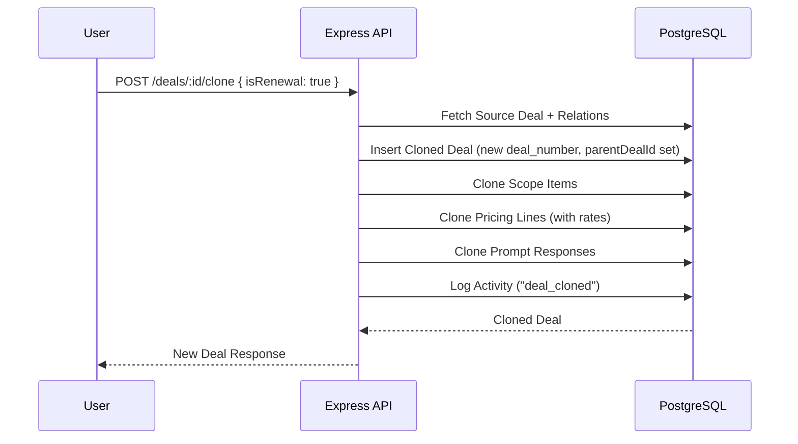
```mermaid
sequenceDiagram
    participant U as User
    participant API as Express API
    participant DB as PostgreSQL

    U->>API: POST /deals/:id/clone { isRenewal: true }
    API->>DB: Fetch Source Deal + Relations
    API->>DB: Insert Cloned Deal (new deal_number, parentDealId set)
    API->>DB: Clone Scope Items
    API->>DB: Clone Pricing Lines (with rates)
    API->>DB: Clone Prompt Responses
    API->>DB: Log Activity ("deal_cloned")
    DB-->>API: Cloned Deal
    API-->>U: New Deal Response
```

---

## 12. Pricing Engine

### Calculation Model

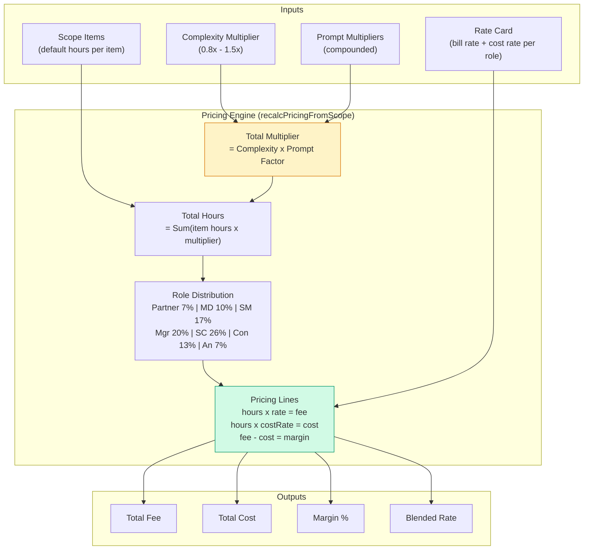
```mermaid
graph TD
    subgraph "Inputs"
        SI["Scope Items<br/>(default hours per item)"]
        CM["Complexity Multiplier<br/>(0.8x - 1.5x)"]
        PM["Prompt Multipliers<br/>(compounded)"]
        RC["Rate Card<br/>(bill rate + cost rate per role)"]
    end

    subgraph "Pricing Engine (recalcPricingFromScope)"
        TM["Total Multiplier<br/>= Complexity x Prompt Factor"]
        TH["Total Hours<br/>= Sum(item hours x multiplier)"]
        RD["Role Distribution<br/>Partner 7% | MD 10% | SM 17%<br/>Mgr 20% | SC 26% | Con 13% | An 7%"]
        PL["Pricing Lines<br/>hours x rate = fee<br/>hours x costRate = cost<br/>fee - cost = margin"]
    end

    subgraph "Outputs"
        TF["Total Fee"]
        TC["Total Cost"]
        MP["Margin %"]
        BR["Blended Rate"]
    end

    SI --> TH
    CM --> TM
    PM --> TM
    TM --> TH
    TH --> RD
    RD --> PL
    RC --> PL
    PL --> TF & TC & MP & BR

    style TM fill:#fef3c7,stroke:#d97706
    style PL fill:#d1fae5,stroke:#059669
```

### Role Distribution Model

| Role | Level | Distribution | Bill Rate | Cost Rate |
|---|---|---|---|---|
| Partner | Partner | 7% | $550/hr | $275/hr |
| Managing Director | Director | 10% | $475/hr | $235/hr |
| Senior Manager | Manager | 17% | $395/hr | $195/hr |
| Manager | Manager | 20% | $345/hr | $170/hr |
| Senior Consultant | Senior | 26% | $285/hr | $140/hr |
| Consultant | Staff | 13% | $225/hr | $110/hr |
| Analyst | Staff | 7% | $175/hr | $85/hr |

### Scenario Generation

Three scenarios are auto-generated from base pricing:

| Scenario | Rate Multiplier | Hours Adjustment | Positioning |
|---|---|---|---|
| **Standard** | 1.0x fee, 1.0x cost | Baseline hours | Cost-competitive baseline |
| **Premium** | 1.15x fee, 1.05x cost | -10% hours | Higher margin, senior-heavy, efficiency-focused |
| **Value** | 0.85x fee, 0.92x cost | +15% hours | Budget-conscious, junior-leveraged, extended timeline |

---

## 13. Azure Target Architecture

### Production Infrastructure Vision

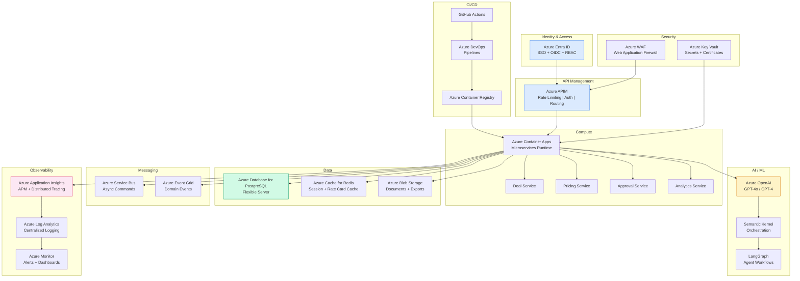
```mermaid
graph TB
    subgraph "Identity & Access"
        EID["Azure Entra ID<br/>SSO + OIDC + RBAC"]
    end

    subgraph "API Management"
        APIM["Azure APIM<br/>Rate Limiting | Auth | Routing"]
    end

    subgraph "Compute"
        CA["Azure Container Apps<br/>Microservices Runtime"]
        ACA1["Deal Service"]
        ACA2["Pricing Service"]
        ACA3["Approval Service"]
        ACA4["Analytics Service"]
        CA --> ACA1 & ACA2 & ACA3 & ACA4
    end

    subgraph "AI / ML"
        AOI["Azure OpenAI<br/>GPT-4o / GPT-4"]
        SK["Semantic Kernel<br/>Orchestration"]
        LG["LangGraph<br/>Agent Workflows"]
        AOI --> SK --> LG
    end

    subgraph "Data"
        PG["Azure Database for PostgreSQL<br/>Flexible Server"]
        REDIS["Azure Cache for Redis<br/>Session + Rate Card Cache"]
        BLOB["Azure Blob Storage<br/>Documents + Exports"]
    end

    subgraph "Messaging"
        SB["Azure Service Bus<br/>Async Commands"]
        EG["Azure Event Grid<br/>Domain Events"]
    end

    subgraph "Security"
        KV["Azure Key Vault<br/>Secrets + Certificates"]
        WAF["Azure WAF<br/>Web Application Firewall"]
    end

    subgraph "Observability"
        AI2["Azure Application Insights<br/>APM + Distributed Tracing"]
        LA["Azure Log Analytics<br/>Centralized Logging"]
        AZ["Azure Monitor<br/>Alerts + Dashboards"]
    end

    subgraph "CI/CD"
        GH["GitHub Actions"]
        ADO["Azure DevOps<br/>Pipelines"]
        ACR["Azure Container Registry"]
        GH --> ADO --> ACR --> CA
    end

    EID --> APIM
    APIM --> CA
    CA --> AOI
    CA --> PG & REDIS & BLOB
    CA --> SB & EG
    KV --> CA
    WAF --> APIM
    CA --> AI2 --> LA --> AZ

    style EID fill:#dbeafe,stroke:#3b82f6
    style APIM fill:#dbeafe,stroke:#3b82f6
    style AOI fill:#fef3c7,stroke:#d97706
    style PG fill:#d1fae5,stroke:#059669
    style AI2 fill:#fce7f3,stroke:#db2777
```

### Azure Component Mapping

| Component | Azure Service | Purpose |
|---|---|---|
| Identity/SSO | Azure Entra ID | OIDC-based SSO with role claims, MFA |
| API Gateway | Azure API Management | Rate limiting, API versioning, OAuth validation |
| Compute | Azure Container Apps | Serverless container orchestration, auto-scaling |
| AI Models | Azure OpenAI (GPT-4o) | LLM inference for all 5 AI use cases |
| AI Orchestration | Semantic Kernel + LangGraph | Multi-step agent workflows, tool calling |
| Primary Database | Azure Database for PostgreSQL | Managed PostgreSQL with automated backups |
| Caching | Azure Cache for Redis | Rate card caching, session state, query results |
| Object Storage | Azure Blob Storage | Deal documents, exported reports, audit archives |
| Async Messaging | Azure Service Bus | Command queue for long-running operations |
| Events | Azure Event Grid | Domain event pub/sub (deal created, approved, etc.) |
| Secrets | Azure Key Vault | API keys, connection strings, certificates |
| WAF | Azure WAF | OWASP protection, DDoS mitigation |
| APM | Application Insights | Performance monitoring, distributed tracing |
| Logging | Log Analytics | Centralized log aggregation and querying (KQL) |
| Alerts | Azure Monitor | Threshold-based alerts, anomaly detection |
| CI/CD | GitHub Actions + Azure DevOps | Build, test, deploy pipelines |
| Container Registry | Azure Container Registry | Private Docker image storage |

### CQRS Readiness

The current monolithic architecture is designed for future CQRS decomposition:

| Concern | Current (PoC) | Target (Production) |
|---|---|---|
| Commands | Direct DB writes via Drizzle | Service Bus command queue |
| Queries | Direct DB reads via Drizzle | Read-optimized views / materialized views |
| Events | Activity log inserts | Event Grid domain events |
| Projections | Dashboard summary query | Denormalized read models in Redis |

---

## 14. External Integrations

### Integration Landscape

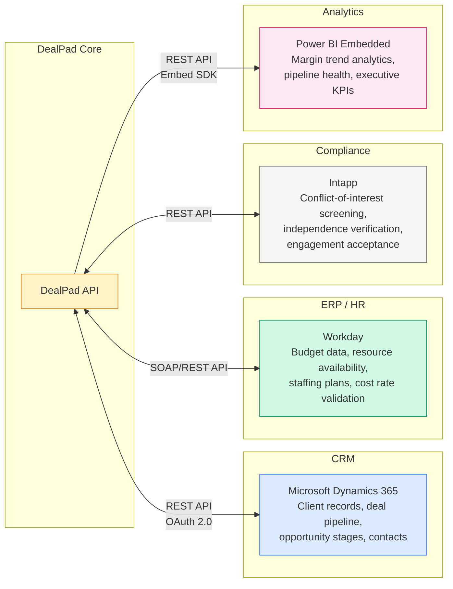
```mermaid
graph LR
    subgraph "DealPad Core"
        DP["DealPad API"]
    end

    subgraph "CRM"
        DYN["Microsoft Dynamics 365<br/>Client records, deal pipeline,<br/>opportunity stages, contacts"]
    end

    subgraph "ERP / HR"
        WD["Workday<br/>Budget data, resource availability,<br/>staffing plans, cost rate validation"]
    end

    subgraph "Compliance"
        IA["Intapp<br/>Conflict-of-interest screening,<br/>independence verification,<br/>engagement acceptance"]
    end

    subgraph "Analytics"
        PBI["Power BI Embedded<br/>Margin trend analytics,<br/>pipeline health, executive KPIs"]
    end

    DP <-->|"REST API<br/>OAuth 2.0"| DYN
    DP <-->|"SOAP/REST API"| WD
    DP <-->|"REST API"| IA
    DP -->|"REST API<br/>Embed SDK"| PBI

    style DP fill:#fef3c7,stroke:#d97706
    style DYN fill:#dbeafe,stroke:#3b82f6
    style WD fill:#d1fae5,stroke:#059669
    style IA fill:#f5f5f4,stroke:#78716c
    style PBI fill:#fce7f3,stroke:#db2777
```

### Integration Details

| System | Direction | Protocol | Data Exchanged | Status |
|---|---|---|---|---|
| **Dynamics CRM** | Bi-directional | REST API, OAuth 2.0 | Client records, deal pipeline, opportunity stages, contacts | Planned (Target) |
| **Workday** | Inbound | SOAP/REST | Budget data, resource availability, staffing plans, cost rates | Planned (Target) |
| **Intapp** | Bi-directional | REST API | Conflict screening, independence verification, engagement acceptance | Planned (Target) |
| **Power BI** | Outbound | REST API, Embed SDK | Margin trends, pipeline health, executive KPI dashboards | Planned (Target) |

### Integration Patterns (Target)

- **API Gateway:** All external integrations routed through Azure APIM for rate limiting, circuit breaking, and credential management
- **Async Processing:** Long-running integration calls (CRM sync, compliance checks) handled via Azure Service Bus
- **Event-Driven:** Deal lifecycle events (created, submitted, approved) published to Event Grid for downstream consumers
- **Circuit Breaker:** Resilience pattern for graceful degradation when external systems are unavailable
- **Data Reconciliation:** Scheduled reconciliation jobs for CRM and Workday data alignment

---

## 15. Observability & Monitoring

### PoC Observability

| Concern | Implementation |
|---|---|
| **Application Logging** | `console.log/error` to stdout; captured by Replit workflow logs |
| **Activity Audit Trail** | `activity_log` table records all deal lifecycle events with user attribution and JSONB metadata |
| **Error Handling** | Try/catch blocks in API handlers; error responses with HTTP status codes |
| **Health Check** | Server startup confirmation log (`Server running on port 3001`) |
| **Database Health** | Schema push and seed confirmation on startup |

### Target Observability Stack (Azure)

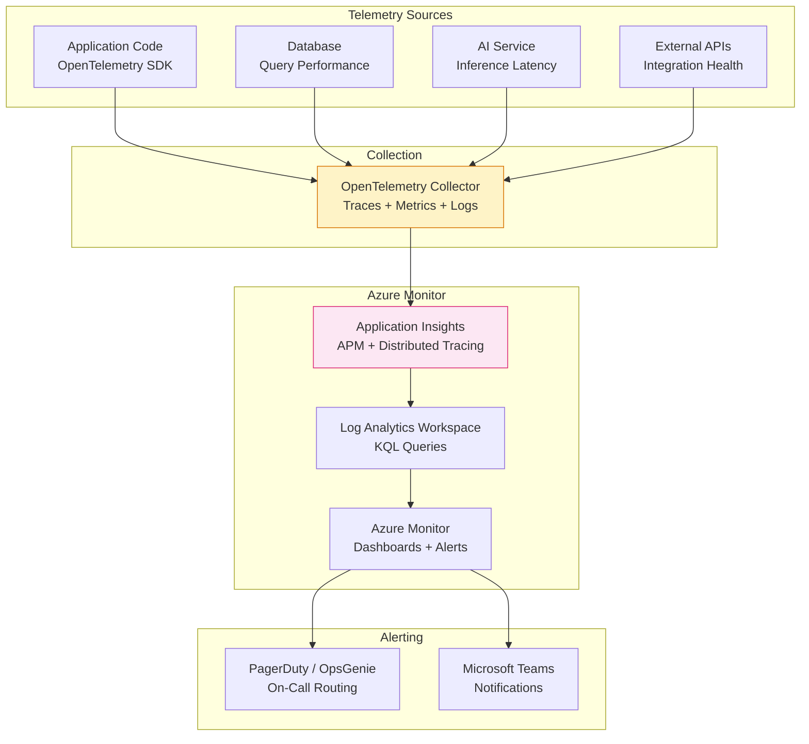
```mermaid
graph TD
    subgraph "Telemetry Sources"
        APP["Application Code<br/>OpenTelemetry SDK"]
        DB["Database<br/>Query Performance"]
        AI["AI Service<br/>Inference Latency"]
        EXT["External APIs<br/>Integration Health"]
    end

    subgraph "Collection"
        OTEL["OpenTelemetry Collector<br/>Traces + Metrics + Logs"]
    end

    subgraph "Azure Monitor"
        APPI["Application Insights<br/>APM + Distributed Tracing"]
        LA["Log Analytics Workspace<br/>KQL Queries"]
        AZM["Azure Monitor<br/>Dashboards + Alerts"]
    end

    subgraph "Alerting"
        PD["PagerDuty / OpsGenie<br/>On-Call Routing"]
        TEAMS["Microsoft Teams<br/>Notifications"]
    end

    APP & DB & AI & EXT --> OTEL --> APPI --> LA --> AZM
    AZM --> PD & TEAMS

    style OTEL fill:#fef3c7,stroke:#d97706
    style APPI fill:#fce7f3,stroke:#db2777
```

### Key Metrics & SLIs

| Category | Metric | Target SLO |
|---|---|---|
| **Availability** | API uptime | 99.9% |
| **Latency** | Deal detail page load (P95) | < 500ms |
| **Latency** | AI endpoint response (P95) | < 2s |
| **Latency** | Dashboard summary query (P95) | < 300ms |
| **Error Rate** | HTTP 5xx responses | < 0.1% |
| **Throughput** | Concurrent deal sessions | 100+ |
| **Data** | Pricing recalculation time | < 200ms |
| **AI** | Risk summary generation time | < 1.5s |

### Audit Trail Design

The `activity_log` table provides a comprehensive audit trail:

| Field | Purpose |
|---|---|
| `deal_id` | Associates activity with a specific deal |
| `action` | Machine-readable action type (e.g., `deal_created`, `deal_updated`, `approval_submitted`) |
| `description` | Human-readable description of the activity |
| `user_name` | Actor who performed the action |
| `metadata` | JSONB payload with action-specific details (changed fields, previous values, etc.) |
| `created_at` | Timestamp of the activity |

---

## 16. Security Architecture

### PoC Security Model

| Concern | Implementation | Risk Level |
|---|---|---|
| Authentication | Client-side persona switcher (localStorage) | High (demo only) |
| Authorization | Client-side permission checks | Medium (no server enforcement) |
| Data Protection | HTTPS via Replit proxy (mTLS) | Low |
| Input Validation | Express JSON parser; basic type checks | Medium |
| SQL Injection | Drizzle ORM parameterized queries | Low |
| CORS | Open CORS policy (`cors()`) | Medium (tighten for production) |
| Secrets | `DATABASE_URL` via environment variable | Low |

### Target Security Architecture (Azure)

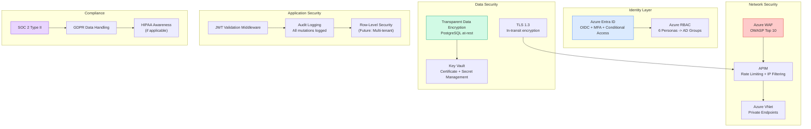
```mermaid
graph TD
    subgraph "Identity Layer"
        EID["Azure Entra ID<br/>OIDC + MFA + Conditional Access"]
        RBAC2["Azure RBAC<br/>6 Personas -> AD Groups"]
    end

    subgraph "Network Security"
        WAF["Azure WAF<br/>OWASP Top 10"]
        APIM2["APIM<br/>Rate Limiting + IP Filtering"]
        VNET["Azure VNet<br/>Private Endpoints"]
    end

    subgraph "Data Security"
        TDE["Transparent Data Encryption<br/>PostgreSQL at-rest"]
        TLS["TLS 1.3<br/>In-transit encryption"]
        KV2["Key Vault<br/>Certificate + Secret Management"]
    end

    subgraph "Application Security"
        JWT["JWT Validation Middleware"]
        AUDIT["Audit Logging<br/>All mutations logged"]
        RLS["Row-Level Security<br/>(Future: Multi-tenant)"]
    end

    subgraph "Compliance"
        SOC2["SOC 2 Type II"]
        GDPR["GDPR Data Handling"]
        HIPAA["HIPAA Awareness<br/>(if applicable)"]
    end

    EID --> RBAC2
    WAF --> APIM2 --> VNET
    TDE --> KV2
    TLS --> APIM2
    JWT --> AUDIT --> RLS
    SOC2 --> GDPR
    GDPR --> HIPAA

    style EID fill:#dbeafe,stroke:#3b82f6
    style WAF fill:#fecaca,stroke:#dc2626
    style TDE fill:#d1fae5,stroke:#059669
    style SOC2 fill:#e9d5ff,stroke:#7c3aed
```

### Security Controls Roadmap

| Control | PoC | Production Target |
|---|---|---|
| Authentication | localStorage persona | Azure Entra ID + OIDC + MFA |
| Authorization | Client-side `hasPermission()` | Server middleware + JWT claims |
| API Security | Open CORS | APIM + WAF + rate limiting |
| Data Encryption (at-rest) | Replit-managed | Azure TDE |
| Data Encryption (in-transit) | Replit mTLS proxy | TLS 1.3 end-to-end |
| Secrets Management | Environment variables | Azure Key Vault |
| Audit Logging | Activity log table | Application Insights + Log Analytics |
| Vulnerability Scanning | Manual | Automated SAST/DAST in CI/CD |
| Penetration Testing | Not performed | Annual third-party pen test |
| Compliance | N/A | SOC 2 Type II alignment |

---

## 17. Deployment Architecture

### PoC Deployment (Replit)

```mermaid
graph LR
    subgraph "Build Phase"
        SRC["Source Code"] --> VITE["Vite Build<br/>npm run build"]
        VITE --> DIST["dist/public/<br/>index.html + assets"]
    end

    subgraph "Runtime"
        TSX["npx tsx server/index.ts"]
        EXPRESS["Express Server<br/>Port 3001"]
        STATIC["express.static<br/>(dist/public)"]
        FALLBACK["SPA Fallback<br/>(index.html)"]
        TSX --> EXPRESS --> STATIC & FALLBACK
    end

    subgraph "Infrastructure"
        REPLIT["Replit Autoscale<br/>Deployment"]
        PG["PostgreSQL<br/>(Replit Managed)"]
    end

    DIST --> STATIC
    EXPRESS --> PG
    REPLIT --> EXPRESS

    style VITE fill:#fef3c7,stroke:#d97706
    style EXPRESS fill:#292524,color:#fafaf9
    style REPLIT fill:#dbeafe,stroke:#3b82f6
```

**Deployment Configuration:**
- **Build Command:** `npm run build` (Vite compiles React to `dist/public/`)
- **Run Command:** `npx tsx server/index.ts` (Express serves API + static assets)
- **Target:** Autoscale (Replit-managed scaling)
- **Database:** Replit PostgreSQL (auto-provisioned, `DATABASE_URL` injected)

### Target Deployment (Azure)

```mermaid
graph TD
    subgraph "Source Control"
        GH["GitHub Repository"]
    end

    subgraph "CI Pipeline"
        GA["GitHub Actions<br/>Lint + Test + Build"]
        ACR["Azure Container Registry<br/>Docker Image Push"]
    end

    subgraph "CD Pipeline"
        ADO["Azure DevOps<br/>Release Pipeline"]
        STG["Staging Environment<br/>(Slot)"]
        PRD["Production Environment<br/>(Container Apps)"]
    end

    subgraph "Environments"
        DEV["Development<br/>Feature branches"]
        QA["QA / UAT<br/>Integration testing"]
        PROD["Production<br/>Blue/Green"]
    end

    GH --> GA --> ACR
    ACR --> ADO
    ADO --> STG --> PRD
    DEV --> QA --> PROD

    style GH fill:#f5f5f4,stroke:#78716c
    style GA fill:#292524,color:#fafaf9
    style PRD fill:#d1fae5,stroke:#059669
```

**Target CI/CD Pipeline:**

1. **Build:** Lint, type-check, unit test, Vite build, Docker image creation
2. **Test:** Integration tests against staging database, API contract tests
3. **Stage:** Deploy to staging slot, run smoke tests, AI endpoint validation
4. **Production:** Blue/green deployment via Container Apps revision, health check gates
5. **Rollback:** Automatic rollback on health check failure

### Environment Strategy

| Environment | Purpose | Database | AI Service |
|---|---|---|---|
| Development | Feature development | Local PostgreSQL | Simulation endpoints |
| Staging | Integration testing | Azure PostgreSQL (staging) | Azure OpenAI (dev tier) |
| Production | Live users | Azure PostgreSQL (production) | Azure OpenAI (production) |

---

## 18. Key Architectural Decisions (ADRs)

### ADR-001: Monolithic PoC with Microservice-Ready Design

**Context:** The PoC needs to demonstrate end-to-end functionality quickly while establishing patterns for future microservice decomposition.

**Decision:** Build as a single Express.js application with clear bounded context separation in the codebase. API routes are organized by domain concern (deals, pricing, approvals, AI). The shared schema provides a single source of truth.

**Consequences:**
- Faster development and deployment for the PoC
- Clear migration path to Azure Container Apps microservices
- Bounded contexts in code translate directly to service boundaries
- No inter-service communication overhead in PoC

---

### ADR-002: Drizzle ORM Over Prisma / TypeORM

**Context:** Need a TypeScript-first ORM that supports PostgreSQL with type-safe queries, relational loading, and minimal overhead.

**Decision:** Use Drizzle ORM with the relational query API and `pg` (node-postgres) driver.

**Rationale:**
- Schema defined in TypeScript (shared between frontend and backend)
- Relational query API (`with` clause) for eager loading without manual joins
- SQL-like query builder for complex aggregations
- Smaller bundle size and faster cold starts than Prisma
- `drizzle-kit push` for schema synchronization without migration files

---

### ADR-003: Wouter Over React Router

**Context:** Need client-side routing for the SPA with minimal bundle impact.

**Decision:** Use Wouter (3.9) instead of React Router.

**Rationale:**
- ~1.5KB vs ~30KB bundle size
- Hook-based API (`useRoute`, `useLocation`) aligns with React patterns
- Sufficient feature set for the application (path params, nested routes, redirects)
- No dependency on context-heavy abstractions

---

### ADR-004: Heuristic-Based AI Simulation

**Context:** PoC needs to demonstrate AI-augmented workflows without Azure OpenAI infrastructure dependency.

**Decision:** Implement all 5 AI use cases as deterministic heuristic engines that produce structured JSON responses identical in shape to what the LLM-backed versions will produce.

**Consequences:**
- Zero external API dependency for the PoC
- Consistent, reproducible results for demos
- API contract is established; only the internal implementation changes for production
- Frontend components are already built against the production response schema
- No API key management or cost during PoC phase

---

### ADR-005: Persona-Based Auth for PoC

**Context:** Production will use Azure Entra ID, but the PoC needs to demonstrate all 6 persona experiences without SSO infrastructure.

**Decision:** Implement a persona switcher with client-side permission enforcement via React Context.

**Rationale:**
- Allows demo users to instantly switch between all 6 personas
- Permission matrix is fully defined and maps directly to Entra ID role claims
- No server-side auth middleware simplifies PoC development
- Clear upgrade path: replace `AuthContext` login with OIDC flow, add JWT middleware

---

### ADR-006: TanStack React Query for Server State

**Context:** Need robust data fetching with caching, background refetching, and mutation invalidation for a data-intensive application.

**Decision:** Use TanStack React Query v5 for all API interactions.

**Rationale:**
- Automatic cache invalidation on mutations (deal update, approval, pricing change)
- Stale-while-revalidate pattern for responsive UI
- Query key hierarchy enables targeted invalidation (e.g., invalidate all deal queries on approval)
- Built-in loading/error states reduce boilerplate
- Optimistic updates for pricing grid interactions

---

### ADR-007: Tailwind CSS v4 with Custom Design System

**Context:** Need a design system that reflects Armanino's brand identity while enabling rapid UI development.

**Decision:** Use Tailwind CSS v4 with CSS custom properties for theming and `@layer components` for reusable patterns.

**Rationale:**
- Utility-first approach enables rapid prototyping
- CSS variables (`--color-primary: #DA720F`) enable theming without build-time configuration
- Component layer (`.btn`, `.card`, `.badge`) provides consistency without a component library dependency
- Persona-specific accent colors implemented via dynamic class application
- No runtime CSS-in-JS overhead

---

### ADR-008: Automated Schema Push Over Migrations

**Context:** During rapid PoC development, traditional migration-based schema management creates friction.

**Decision:** Use `CREATE TABLE IF NOT EXISTS` in the server startup sequence with Drizzle schema as the source of truth.

**Rationale:**
- Zero-friction schema changes during development
- Server self-initializes database on first deployment
- Seed data applied conditionally (idempotent)
- Production will transition to versioned migrations with `drizzle-kit generate` and `drizzle-kit migrate`

---

### ADR-009: Single-Server Architecture (API + Static)

**Context:** Deployment simplicity is critical for the PoC.

**Decision:** Express serves both the API (`/api/*`) and the built Vite frontend (`dist/public/`) from a single process.

**Rationale:**
- Single deployment artifact
- No CDN or separate static hosting configuration needed
- SPA fallback (catch-all to `index.html`) handled in the same process
- Vite dev server proxies `/api` calls during development for DX parity
- Production target separates concerns: CDN for static, Container Apps for API

---

### ADR-010: Activity Log as Event Source Precursor

**Context:** Full event sourcing is premature for the PoC, but auditability is a firm requirement.

**Decision:** Implement an `activity_log` table that records all significant deal lifecycle events with actor attribution and JSONB metadata.

**Consequences:**
- Provides immediate audit trail for compliance
- JSONB metadata field is flexible for varying event shapes
- Natural migration path to Event Grid domain events in production
- Activity feed displayed on dashboard and deal detail views
- Foundation for analytics and reporting on user behavior

---

## 19. Future Roadmap

### Phase 2: Production MVP

| Capability | Description | Azure Services |
|---|---|---|
| Azure Entra ID Integration | Replace persona switcher with SSO + MFA | Entra ID, OIDC |
| Server-Side Authorization | JWT middleware with role enforcement | APIM, Express middleware |
| Azure OpenAI Integration | Replace heuristic AI with GPT-4o inference | Azure OpenAI, Semantic Kernel |
| CI/CD Pipeline | Automated build, test, deploy | GitHub Actions, Azure DevOps |
| Container Deployment | Dockerized services on Container Apps | ACR, Container Apps |

### Phase 3: Enterprise Features

| Capability | Description |
|---|---|
| CRM Integration | Bi-directional sync with Dynamics 365 |
| Workday Integration | Real-time resource availability and budget validation |
| Intapp Integration | Automated conflict-of-interest screening |
| Power BI Embedded | Advanced analytics dashboards within DealPad |
| Multi-Tenant RBAC | Row-level security for practice group isolation |
| Document Generation | Automated SOW/proposal generation from deal data |
| Notification Engine | Email/Teams notifications for approval workflow |

### Phase 4: Advanced AI

| Capability | Description |
|---|---|
| Fine-Tuned Models | Armanino-specific effort prediction models trained on historical data |
| RAG-Based Similarity | Vector store of historical deals for semantic search |
| Multi-Agent Workflows | LangGraph orchestration of chained AI tasks (scope -> price -> risk in one flow) |
| Predictive Analytics | Win probability scoring based on deal attributes |
| Natural Language Querying | "Show me all deals above 30% margin in the West region" |

---

## Appendix A: Technology Stack Summary

| Category | PoC Technology | Production Target |
|---|---|---|
| **Frontend** | React 19, Vite, Tailwind CSS 4, TypeScript | Same |
| **Backend** | Express.js 5, TypeScript, tsx | Express.js or NestJS on Container Apps |
| **ORM** | Drizzle ORM 0.45 | Drizzle ORM with migrations |
| **Database** | PostgreSQL (Replit) | Azure Database for PostgreSQL |
| **AI** | Heuristic simulation | Azure OpenAI + Semantic Kernel |
| **Auth** | localStorage persona | Azure Entra ID + OIDC |
| **Hosting** | Replit Autoscale | Azure Container Apps |
| **CI/CD** | Replit auto-deploy | GitHub Actions + Azure DevOps |
| **Monitoring** | Console logs + activity log | Application Insights + Log Analytics |
| **Secrets** | Environment variables | Azure Key Vault |
| **CDN** | N/A | Azure Front Door |
| **Messaging** | Synchronous API calls | Azure Service Bus + Event Grid |

## Appendix B: File Structure

```
dealpad/
├── client/
│   └── src/
│       ├── App.tsx                    # Router + auth guards
│       ├── index.css                  # Design system (Tailwind v4)
│       ├── main.tsx                   # React entry point
│       ├── components/
│       │   ├── layout/
│       │   │   ├── AppLayout.tsx      # Shell: sidebar + content
│       │   │   └── Sidebar.tsx        # Navigation + persona display
│       │   └── ui/                    # Radix-based UI primitives
│       ├── context/
│       │   └── AuthContext.tsx         # Persona RBAC engine
│       ├── hooks/
│       │   └── use-api.ts             # React Query API layer
│       ├── lib/
│       │   └── utils.ts               # Tailwind merge utility
│       └── pages/
│           ├── Dashboard.tsx           # Role-aware command center
│           ├── DealDetail.tsx          # 8-step deal wizard
│           ├── DealsList.tsx           # Filterable deal table
│           ├── Login.tsx               # Persona selection
│           ├── NewDeal.tsx             # Deal creation form
│           ├── Architecture.tsx        # System diagrams
│           ├── ArchitectureInteractive.tsx  # Interactive diagram
│           ├── RateCards.tsx           # Rate card admin
│           └── ScopeCatalogAdmin.tsx   # Scope catalog admin
├── server/
│   ├── index.ts                       # Server entry + schema init
│   ├── routes.ts                      # All API endpoints
│   ├── db.ts                          # Drizzle + pg pool
│   └── seed.ts                        # Demo data seeding
├── shared/
│   └── schema.ts                      # Drizzle schema (source of truth)
├── package.json
├── vite.config.js
├── drizzle.config.ts
└── tsconfig.json
```

---

*Document generated for Armanino LLP - DealPad PoC v1.0*  
*This document reflects the architecture as implemented in the Proof of Concept. Production architecture decisions are subject to refinement during Phase 2 planning.*
