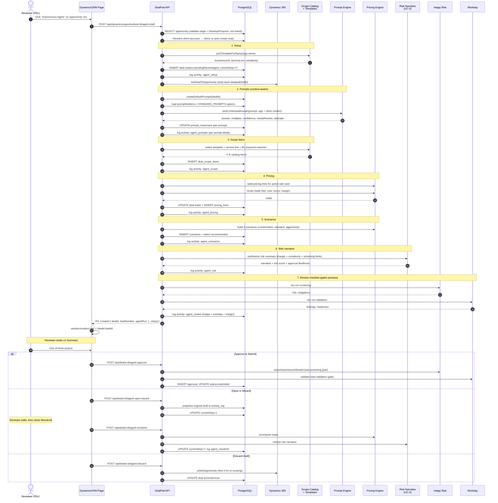
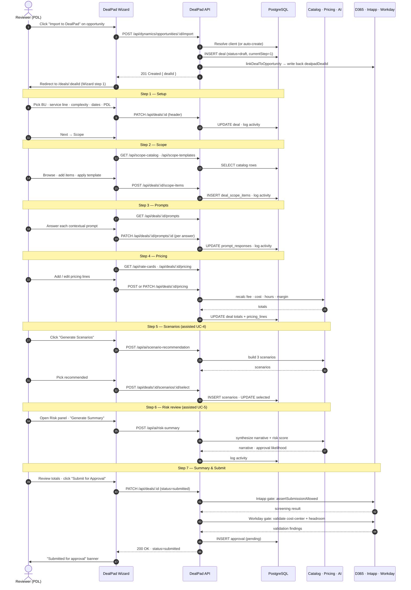

# Autonomous Agent — Sequence Diagram

End-to-end execution of the one-click "Autonomous Agent" flow that drafts a complete DealPad deal from a Dynamics 365 opportunity.

## Notes

- **Pipeline is sequential and synchronous** — the user sees a progress modal, then is redirected. No background jobs.
- **Each step writes one `activity_log` row** with `metadata.agentRun = { step, label, summary, output, confidence, needsReview, ts }` — that's what powers the "Agent Run Details" panel on the deal page.
- **Failure isolation**: a failure in any step rolls the deal back to discardable state. The reviewer can always discard or open in wizard.
- **Same approval gates as the wizard**: Intapp and Workday gates are enforced at agent-approve, never bypassed.

---

# Manual Wizard Flow — Sequence Diagram

For comparison: same opportunity, walked through DealPad by hand. Same bounded contexts, same approval gates, but the reviewer is the orchestrator instead of the agent.

## Comparison

| Dimension | Autonomous Agent | Manual Wizard |
|---|---|---|
| Reviewer touches | 1 click + final approve | ~30+ clicks across 7 wizard steps |
| Time to Summary | ~3–8 seconds (synchronous) | ~15–25 minutes |
| Where decisions are made | Engine + per-prompt context inference | Reviewer types every answer |
| Confidence signals | Per-step + per-prompt confidence + needsReview flags | None — reviewer is the only signal |
| Approval gates | Same Intapp + Workday gates (at agent-approve) | Same Intapp + Workday gates (at submit) |
| Audit trail | Per-step activity_log with structured agentRun metadata | Per-action activity_log entries |
| Reviewer override | Approve · Open in Wizard · Discard | Edit any step before submit |
